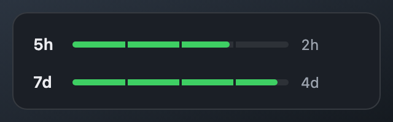
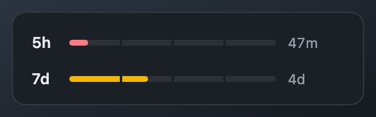
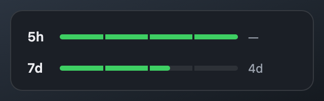
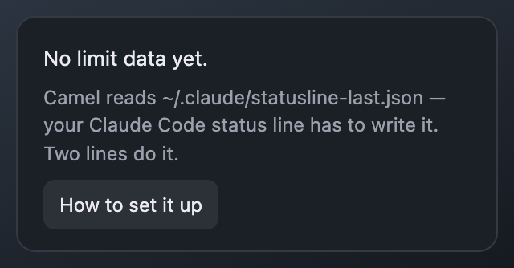
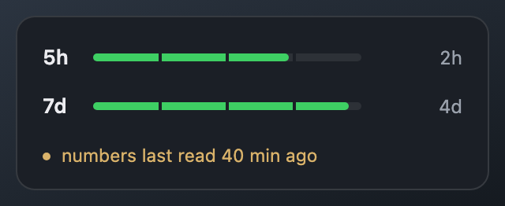

<p align="center">
  
</p>

<h1 align="center">Camel</h1>

<p align="center">Your Claude Code usage limits, always in the menu bar.</p>

<p align="center">Install it, then ask your agent to read <a href="SETUP.md">SETUP.md</a> — it wires itself up.</p>

<p align="center">
  <b>Free · Private · Reads one local file, sends nothing anywhere</b>
</p>

---

## Get it

<p align="center">
  <a href="https://github.com/olegperegudov/camel/releases/latest/download/Camel_macOS_AppleSilicon.dmg"></a>
  &nbsp;
  <a href="https://github.com/olegperegudov/camel/releases/latest/download/Camel_macOS_Intel.dmg"></a>
  &nbsp;
  <a href="https://github.com/olegperegudov/camel/releases/latest/download/Camel_Windows_Setup.exe"></a>
</p>

<p align="center"><sub>Need an older version? <a href="https://github.com/olegperegudov/camel/releases">Releases page</a>.</sub></p>

After downloading:

1. Let macOS run it. Gatekeeper calls unnotarized apps "damaged" — run
   `xattr -dr com.apple.quarantine /Applications/Camel.app` once, or use
   System Settings → Privacy & Security → **Open Anyway** after the first block.
2. Connect it to Claude Code — one message, see below.
3. Look at the menu bar — the gauges are already yours.

### Let your agent wire it up

Camel needs your Claude Code status line to save what it is handed. You already
have an agent that can do that. Open Claude Code anywhere and paste:

> Set up Camel by following
> https://raw.githubusercontent.com/olegperegudov/camel/main/SETUP.md

[SETUP.md](SETUP.md) is written for the agent, not for you: it says which config
directories to look in, what to add to an existing status line without breaking
it, how to register it, and how to verify the result. Prefer to do it by hand?
The same thing in two lines is further down, under
[Where the numbers come from](#where-the-numbers-come-from).

## Two gauges, zero clicks

The left pill is your last 5 hours, the right one your last 7 days. Green means
plenty, yellow means half is gone, red means three quarters are. Hover for the
exact numbers. A green dot on the icon means a Camel update is ready.

Signed into Claude Code more than once — a personal account and a work one? Each
login gets its own pair of pills, side by side, with a wider gap between the
pairs than inside them. The panel lists them by name, and each is dated on its
own: one can be minutes old while the other has been idle since yesterday.

<p align="center"></p>

## Click for how long it has to last

One line per window. The length of the line is what's left, and next to it is
how long that has to last. Nothing else — no percentages to decode, no reset
times to subtract in your head.

Three hairline notches cut each line into quarters, so "past the halfway mark"
is something you see rather than estimate.

<p align="center"></p>

The colour changes on its own: yellow once half the window is gone, red at
three quarters. A short red line next to a small number is the whole warning.

<p align="center"></p>

A window that has already come back shows full, with a dash where the
countdown would be — nothing has scheduled the next reset yet.

<p align="center"></p>

## Where the numbers come from

Claude Code hands its status line a JSON with your rate limits. Camel reads
the copy of it at `statusline-last.json` — a few lines added to any statusline
script:

```bash
# inside your statusline.sh, before printing:
# Write next to the config this session belongs to, not to a fixed path: with
# more than one login on the machine they would take turns overwriting one file.
config=$(printf '%s' "$input" | jq -r '.transcript_path // empty' | sed -n 's|\(.*\)/projects/.*|\1|p')
[ -z "$config" ] && config="${CLAUDE_CONFIG_DIR:-$HOME/.claude}"

if printf '%s' "$input" | jq -e '.rate_limits.five_hour.used_percentage != null' >/dev/null 2>&1; then
  printf '%s' "$input" > "$config/statusline-last.json"
fi
```

No statusline yet? Run `/statusline` in Claude Code and ask it to save its
input JSON as `statusline-last.json` inside its own config directory.

Until that file exists, Camel says so and offers the way out — it never shows
a zero it doesn't have.

<p align="center"></p>

The status line writes on every turn, so the numbers are usually seconds old.
When they aren't — half an hour of silence or more — the panel says how old
they are instead of letting you read them as current.

<p align="center"></p>

## Updates

When the camel's icon grows a green dot, an update is ready — right-click the
icon → **Update to vX.Y.Z**. Done in seconds, settings survive. The version you
are on lives in the same menu, which is why the panel itself stays wordless.

## Privacy

- Reads exactly one file per login: `statusline-last.json` inside each Claude Code
  config directory it finds in your home. Nothing else.
- Sends nothing anywhere. The only network call is checking GitHub for its own updates.
- No analytics, no telemetry, no accounts.

## Under the hood

Stack, local builds, tests, CI and signing live in [docs/DEVELOPMENT.md](docs/DEVELOPMENT.md).

## License

MIT
