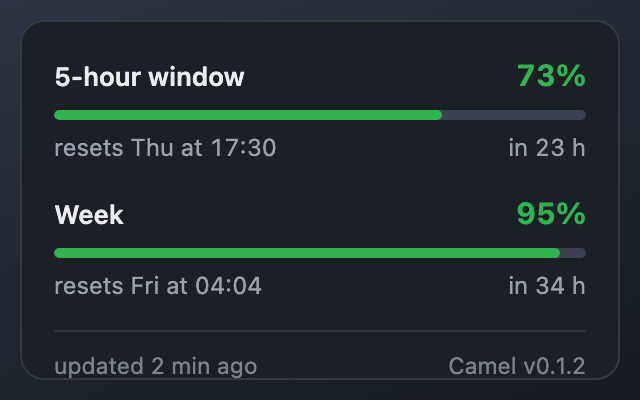
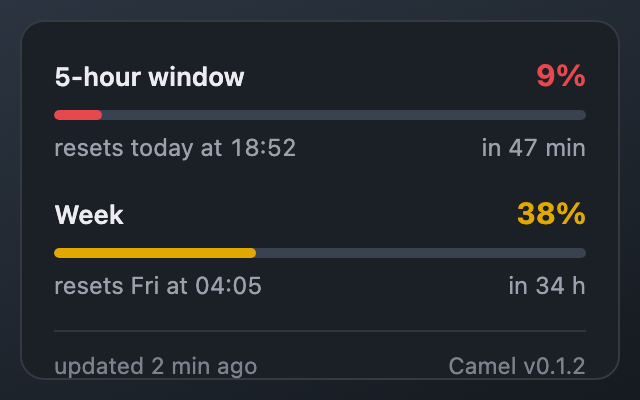
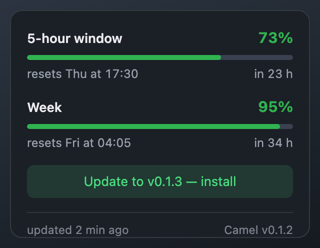

<p align="center">
  
</p>

<h1 align="center">Camel</h1>

<p align="center">Your Claude Code usage limits, always in the menu bar.</p>

<p align="center">
  <b>Free · Private · Reads one local file, sends nothing anywhere</b>
</p>

---

## Get it

<p align="center">
  <a href="https://github.com/olegperegudov/camel/releases/latest/download/Camel_macOS_AppleSilicon.dmg"></a>
  &nbsp;
  <a href="https://github.com/olegperegudov/camel/releases/latest/download/Camel_macOS_Intel.dmg"></a>
  &nbsp;
  <a href="https://github.com/olegperegudov/camel/releases/latest/download/Camel_Windows_Setup.exe"></a>
</p>

<p align="center"><sub>Need an older version? <a href="https://github.com/olegperegudov/camel/releases">Releases page</a>.</sub></p>

After downloading:

1. Let macOS run it. Gatekeeper calls unnotarized apps "damaged" — run
   `xattr -dr com.apple.quarantine /Applications/Camel.app` once, or use
   System Settings → Privacy & Security → **Open Anyway** after the first block.
2. Make sure your Claude Code status line writes `~/.claude/statusline-last.json` (see below).
3. Look at the menu bar — the bars are already yours.

## Two bars, zero clicks

The left bar is your 5-hour window, the right one is your week. Green means
plenty, yellow means half gone, red means running dry. The number is whichever
window is closer to empty. A green dot on the icon means a Camel update is
ready.

<p align="center"></p>

## Click for the full picture

Both windows, how much is left, when each resets, and how fresh the data is.

<p align="center"></p>

When a window runs low, the panel says so in colour:

<p align="center"></p>

## Where the numbers come from

Claude Code hands its status line a JSON with your rate limits. Camel reads
the copy of it at `~/.claude/statusline-last.json` — a two-line addition to
any statusline script:

```bash
# inside your ~/.claude/statusline.sh, before printing:
if printf '%s' "$input" | jq -e '.rate_limits.five_hour.used_percentage != null' >/dev/null 2>&1; then
  printf '%s' "$input" > ~/.claude/statusline-last.json
fi
```

No statusline yet? Run `/statusline` in Claude Code and ask it to save its
input JSON to `~/.claude/statusline-last.json`.

## Updates

When the camel's icon grows a green dot, an update is ready — click the icon
and install from the panel, or right-click → **Update to vX.Y.Z**. Done in
seconds, settings survive.

<p align="center"></p>

## Privacy

- Reads exactly one file: `~/.claude/statusline-last.json`. Nothing else.
- Sends nothing anywhere. The only network call is checking GitHub for its own updates.
- No analytics, no telemetry, no accounts.

## Under the hood

Stack, local builds, tests, CI and signing live in [docs/DEVELOPMENT.md](docs/DEVELOPMENT.md).

## License

MIT
